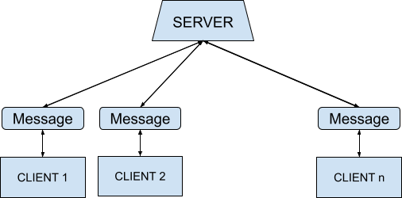
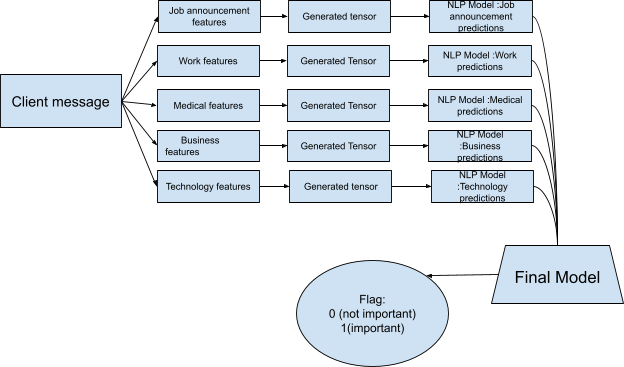
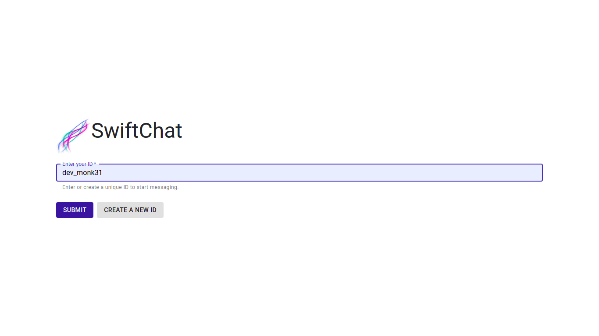
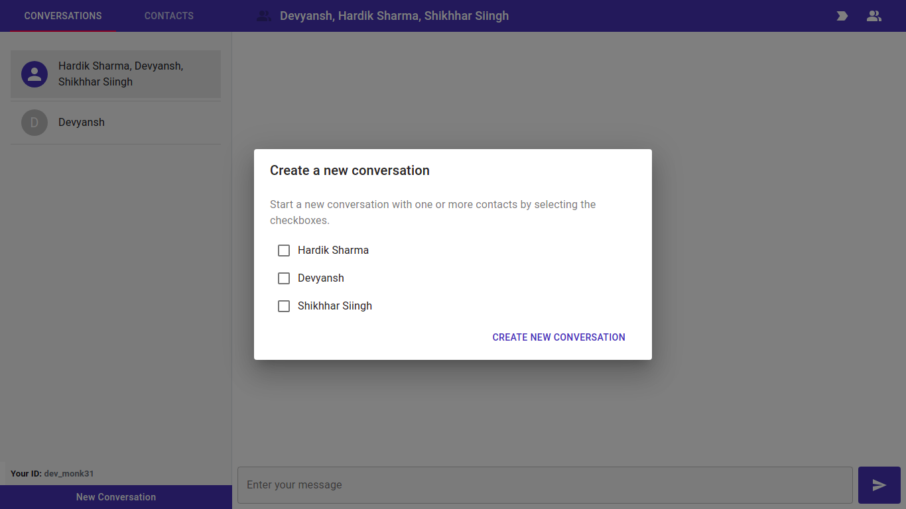
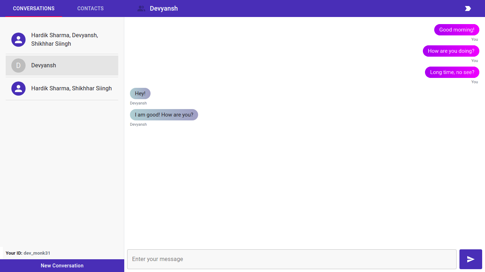
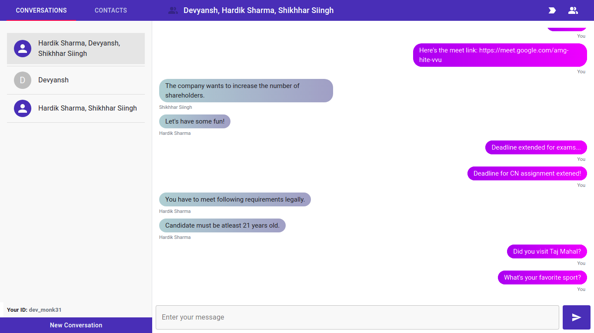
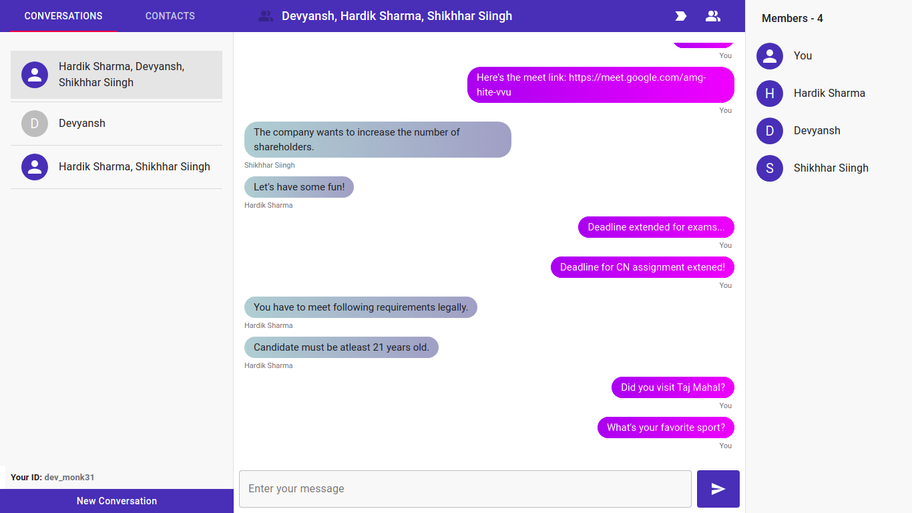
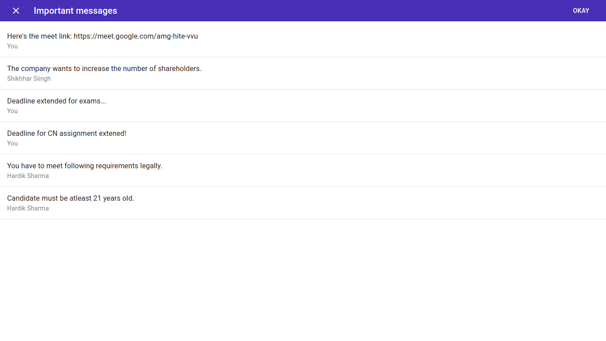

# SwiftChat

A web-based chat application with integrated sentiment analysis.  
It filters the messages based on their relevance so the user need not read all unnecessary messages. The application will mark the message as either grapevine or important. The users can then check the filtered messages using a button.

# Implementation
**1. Chat application architecture:** 
Using socket.io, the message from one client reaches the other via uni/broadcasting with the help of an http server (using socket.io).  
  

**2. NLP Processing Pipeline:** 
A given message string is first processed (punctuation removed and spaces added at the front and end) and converted to a large list of 0s and 1s (tensors) which are fed to a set of intermediate binary backpropagation models (trained using Keras and Tensorflow) which produce an array of 0s and 1s. This is fed to a final binary backpropagation model which combines these values and produces a flag of 0 (not important) and 1 (important) message accordingly.  

# Technical features
* Classification of messages is done in the browser itself so privacy is in control of users.
* Faster processing because of client side deployment of models.
* Node.js can handle many clients' communications.
* Asynchronous calls in Node.js ensure better resource utilization with faster message delivery.

# Demonstration
Following steps are involved in the application usage:

- User logs in the application with their ID or creates a new account
  - Creating a new account
  - Logging in with existing ID
  
  

- Chat window where user can add contacts, and create a new conversation with a single user or a group of users (group chat feature)
  - Adding a contact
  
  
  
  - Selecting contact(s) for conversations
  
  
  
  - Individual conversations
  
  
  
  - Group conversations
  
  

- User can also click on the people button which shows the people involved in the  group conversation

  

- Finally, the label important button shows the messages which have been marked as important by the NLP system.

  
  
# Tech Stack
- Chat application: React.js, Node.js, Socket.io
- Machine Learning (training, testing and deployment): TensorFlow, TensorFlow.js, Keras, NumPy, pandas

# Problem addressed
In groups with a lot of messages in real time chat apps like WhatsApp, filtering out messages of relevance becomes a time-consuming task, because of different types of messages; some messages are important notifications while others are grapevine chat (less important or general discussions). 
Since it becomes tedious to find out the important messages being received from a large pool of messages, they can go unnoticed quite a few times. Thus, there should be a way to segregate the notifications of relevance in one place.

**NOTE:** This project is still under development for more accuracy and reliability of the models.
