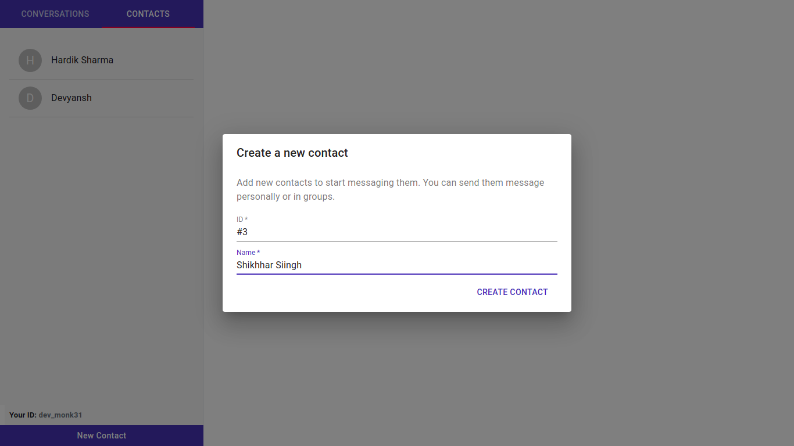

## SwiftChat

A web-based chat application with integrated sentiment analysis.

## Implementation
**1. Chat application architecture:** 

Using socket.io, the message from one client reaches the other via uni/broadcasting with the help of an http server (using socket.io).  
  

**2. NLP Processing Pipeline:** 

A given message string is preprocessed (punctuation removed and spaces added at the front and end) and converted to a large list of 0s and 1s (tensors) which are fed to a set of intermediate binary backpropagation models (trained using Keras and Tensorflow) which produce an array of 0s and 1s. This is fed to a final binary backpropagation model which combines these values and produces a flag of 0 (not important) and 1 (important) message accordingly.  

## Technical features
* Classification of messages is done in the browser itself so privacy is in control of users.
* Faster processing because of client side deployment of models.
* Node.js can handle a large number of clients' communication.
* Asynchronous calls in Node.js ensure better resource utilization with faster message delivery.

## Demonstration
Following steps are involved in the application usage:

- User logs in the application with their ID or creates a new account
  - Creating a new account
  - Logging in with existing ID
  
  

- Chat window where user can add contacts, and create a new conversation with a single user or a group of users (group chat feature)
  - Adding a contact
  
  
  
  - Selecting contact(s) for conversations
  
  
  
  - Individual conversations
  
  
  
  - Group conversations
  
  

- User can also click on the people button which shows the people involved in the  group conversation

  

- Finally, the label important button shows the messages which have been marked as important by the NLP system.

  

